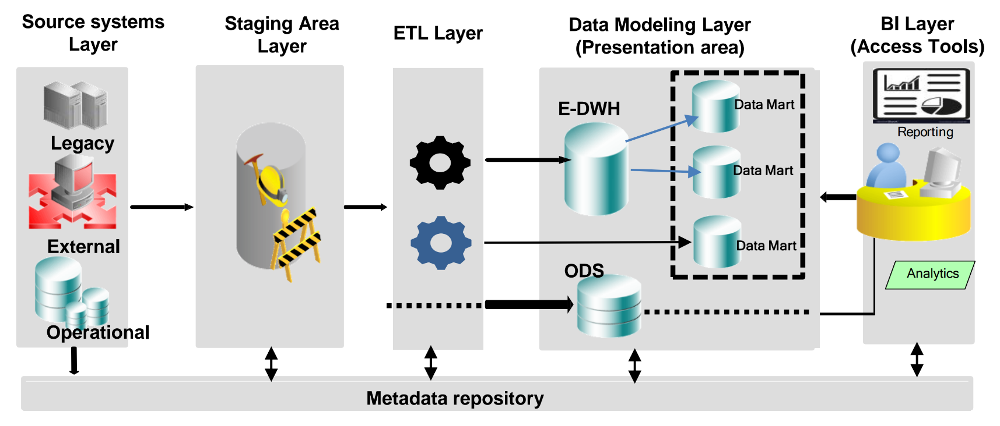
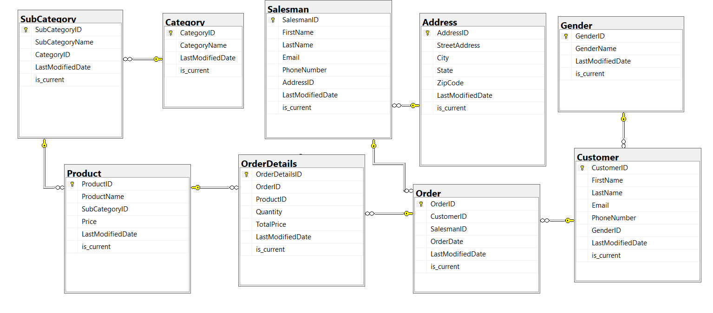
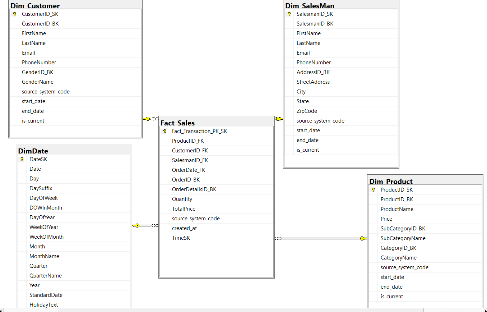
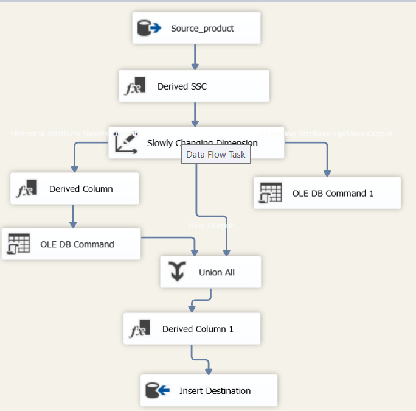
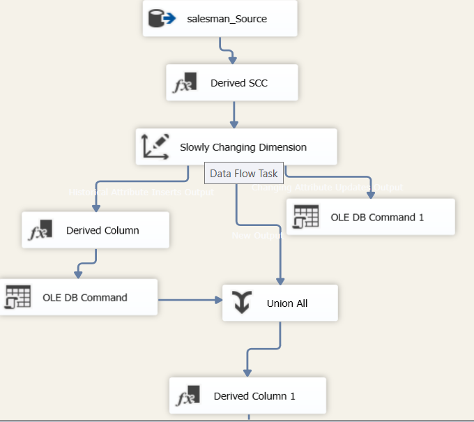
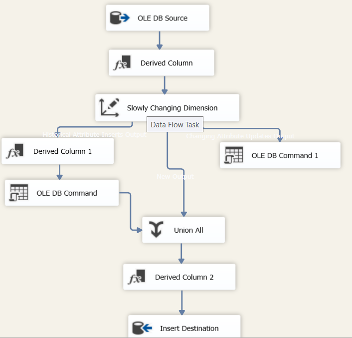
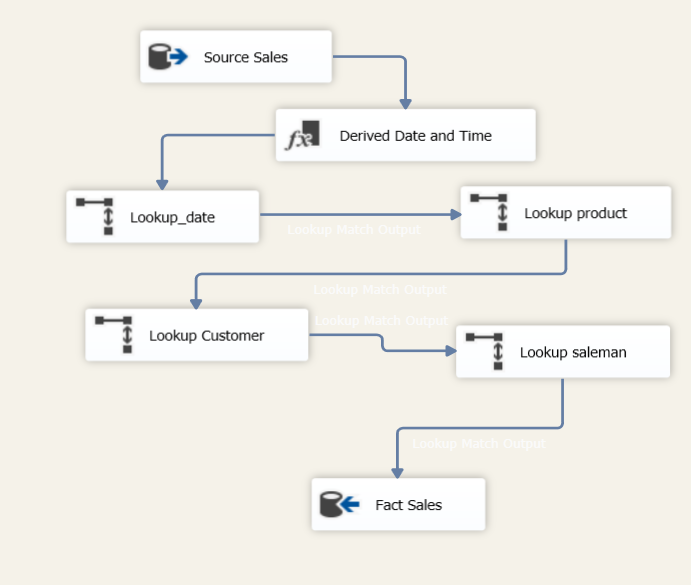
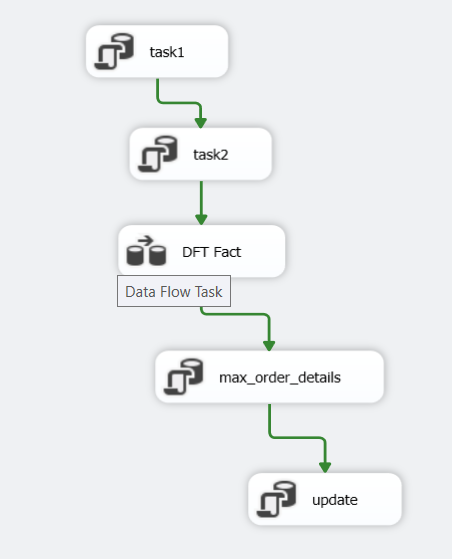
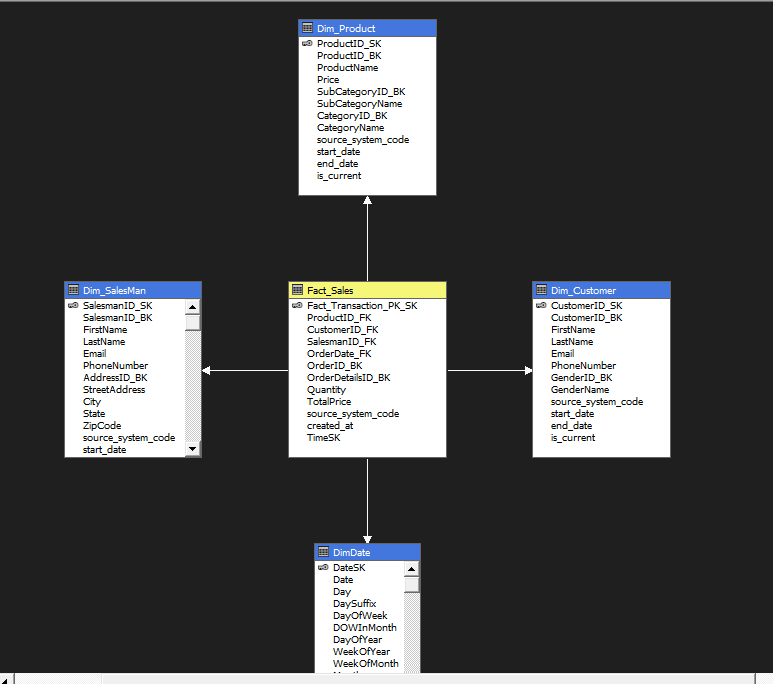
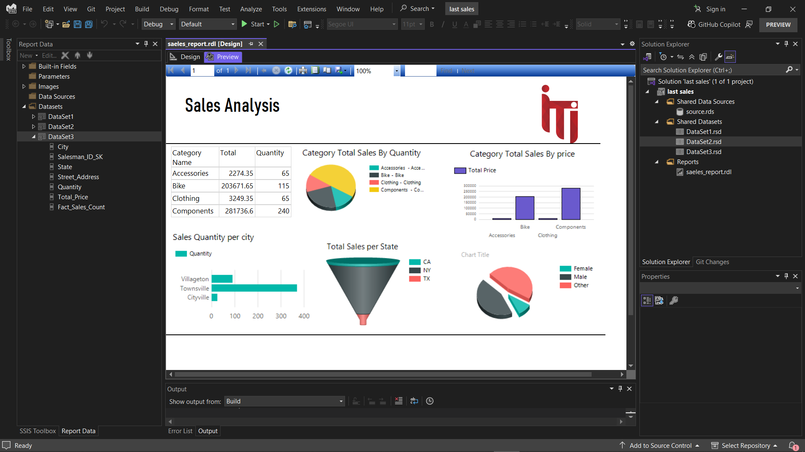

# Sales-and-Performance-Analysis-Data-Warehouse-Project-SSIS-SSAS-SSRS-
Sales and Performance Analysis — Data Warehouse Project (SSIS | SSAS | SSRS) 

📁 Project Overview
This project showcases a complete end-to-end Data Warehousing Solution, starting from a normalized transactional database and culminating in business insights delivered through SSRS reports. It integrates core components of the Microsoft BI Stack including SSIS (ETL), SSAS (Cubes), and SSRS (Reporting).

The goal is to transform raw transactional data into meaningful KPIs that support business decision-making and performance analysis.

🛠 Tools & Technologies Used
| Tool           | Purpose                                              |
| -------------- | ---------------------------------------------------- |
| **SQL Server** | Hosting both the transactional DB and data warehouse |
| **SSIS**       | Data extraction, transformation, and loading         |
| **SSAS**       | Building OLAP cubes for analytical querying          |
| **SSRS**       | Creating interactive and paginated reports           |

🔄 Project Workflow

1. Transactional Database (Source)
The project begins with a normalized database representing the operational side of the business.

    * Highly normalized structure

    * Inefficient for reporting

    * Source for ETL

   
      

2. Data Warehouse Design
Data is reorganized using a Star Schema to optimize for reporting and analysis.

    * act Tables: Central tables with business metrics

    * Dimension Tables: Lookup tables for descriptive context
 
  FactSales

├── DimProduct
├── DimCustomer
├── DimDate
├── DimRegion
 
   

3. ETL Process with SSIS
SSIS is used to build and schedule the data pipeline.

    * Extracts data from the transactional DB

    * Applies necessary transformations (e.g., type casting, cleaning)

    * Loads data into the data warehouse

Key components:

  * Data Flow Tasks

  * Lookup & Derived Columns

  * Slowly Changing Dimensions

    #ETL in action:Using SSIS to extract, transform, and load data into the warehouse.

       Transform data from database to data warehouse product_dim
    
       

    
       Transform data from database to data warehouse Salesman_dim
    
       

       Transform data from database to data warehouse Customer_dim
       

       link the fact table with the dimentions with FK
    
       
       

🧠 Why Are SCDs Important?
Without SCDs, if a customer moves to a new region or a product changes category, your data warehouse would overwrite the old value, losing the history. SCDs help preserve those changes to maintain data accuracy over time, which is critical for accurate trend analysis, auditing, and business insights.

🛠️ Types of Slowly Changing Dimensions

🔹 Type 0 – Fixed Dimension
    * No changes are allowed.
    * The data remains as it was at the time of the initial load.
    * Used when attributes must remain historically accurate and unaltered

🔹 Type 1 — Overwrite (No History)
    * The old data is replaced with the new data.
    * Used when history is not important.

🔹 Type 2 — Add New Row (Preserve History)
    * A new record is added with a new surrogate key.
    * Keeps full history of changes.
    * Often includes: StartDate, `

🔹 Type 3 – Add New Column (Limited History)
    * Adds a new column to store the previous value.
    * Only keeps limited history (usually one prior state).

4. Building OLAP Cubes with SSAS
    * SSAS enables multidimensional analysis and enhances performance with pre-aggregated data.
    * Designed cubes with measures and dimensions
    * Enabled slicing/dicing, drill-down, and roll-up
    * Created KPIs for dashboards
      

      
5. Visualizing with SSRS
    * Finally, SSRS was used to build professional, paginated reports.
    * Interactive dashboards
    * Parameterized reports
    * Export options (Excel, PDF, Word)
  
      
  
📈 This system allows stakeholders to:

  Analyze sales performance across regions and time

  Track product trends

  Evaluate customer behavior and retention

  Improve decision-making using historical data

🧠 Key Learnings
  Practical application of Data Warehousing Concepts

  Hands-on experience with Microsoft BI Tools

  Real-world ETL challenges and dimensional modeling

  Bridging operational data to business insights

✅ Conclusion
This project demonstrates a full BI solution lifecycle using Microsoft's BI Stack. It exemplifies how raw data can be transformed into powerful insights through structured modeling and robust tooling.
